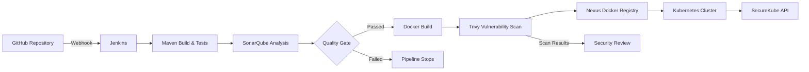

# 🔐 SecureKube

> A production-inspired DevSecOps CI/CD pipeline for a Spring Boot REST API, integrating automated code analysis, quality gates, container security scanning, private image storage, and Kubernetes deployment on AWS.

---

## 📌 Project Overview

SecureKube is a hands-on DevSecOps project designed to demonstrate an end-to-end CI/CD pipeline with security integrated throughout the software delivery lifecycle.

The project uses a Spring Boot REST API as the application and automates the journey from source code commit to a running application on Kubernetes.

### Pipeline

**GitHub → Jenkins → Maven → SonarQube → Quality Gate → Docker → Trivy → Nexus → Kubernetes**

Every application change can automatically trigger the pipeline, build and test the application, analyze the source code, scan the container image, publish the image to a private registry, and deploy the new version to Kubernetes.

---

## 🏗️ Architecture



---

## ☁️ AWS Infrastructure

The project is deployed across multiple AWS EC2 instances.

```text
AWS
│
├── Jenkins EC2
│   └── CI/CD automation
│
├── SonarQube EC2
│   └── Static code analysis & Quality Gate
│
├── Nexus EC2
│   └── Private Docker Registry
│
└── Kubernetes EC2
    ├── kubeadm
    ├── containerd
    ├── Calico CNI
    └── SecureKube API
```

### Infrastructure Components

| Component | Purpose |
|---|---|
| AWS EC2 | Compute infrastructure |
| Jenkins | CI/CD automation |
| SonarQube | Static code analysis |
| Nexus Repository | Private Docker image registry |
| Kubernetes | Container orchestration |
| Calico | Kubernetes networking |
| containerd | Kubernetes container runtime |
| Trivy | Container vulnerability scanning |

Private VPC communication is used between infrastructure components wherever possible.

---

# 🔄 CI/CD Pipeline

The Jenkins pipeline consists of the following stages:

### 1. Build

Maven compiles the Spring Boot application and executes automated tests.

```bash
mvn clean package
```

The project currently contains automated tests covering the application and controller layers.

---

### 2. SonarQube Analysis

The source code is analyzed using SonarQube.

The pipeline integrates with the configured SonarQube server using Jenkins' SonarQube integration.

---

### 3. Quality Gate

The pipeline waits for the SonarQube Quality Gate result.

```groovy
timeout(time: 5, unit: 'MINUTES') {
    waitForQualityGate abortPipeline: true
}
```

If the Quality Gate fails, the pipeline stops before creating and deploying the container image.

This prevents code that does not meet the configured quality criteria from progressing through the deployment pipeline.

---

### 4. Docker Image Build

A Docker image is created using the application JAR.

```bash
docker build -t securekube:${BUILD_NUMBER} .
```

The Jenkins build number is used as the image tag.

Example:

```text
securekube:25
```

This provides versioned images instead of relying exclusively on the `latest` tag.

---

### 5. Trivy Container Scan

The generated Docker image is scanned using Trivy.

```bash
trivy image securekube:${BUILD_NUMBER}
```

The scan identifies known vulnerabilities in the container image and its underlying dependencies.

---

### 6. Push to Nexus

The versioned image is tagged for the private Nexus Docker registry.

Example:

```text
<NEXUS_PRIVATE_HOST>:8082/securekube:25
```

The image is then pushed to Nexus.

Nexus acts as the project's private Docker registry.

---

### 7. Kubernetes Deployment

After the image is successfully stored in Nexus, Jenkins updates the Kubernetes Deployment.

```bash
kubectl set image deployment/securekube-api \
securekube-api=<NEXUS_REGISTRY>/securekube:${BUILD_NUMBER}
```

Jenkins then waits for Kubernetes to complete the rollout:

```bash
kubectl rollout status deployment/securekube-api
```

The pipeline therefore verifies that the new application version has successfully rolled out before reporting success.

---

# 🔐 DevSecOps Security

Security is integrated into multiple stages of the delivery pipeline.

### Source Code Security

**SonarQube**

- Static code analysis
- Code quality checks
- Quality Gate enforcement
- Pipeline stops when the configured Quality Gate fails

### Container Security

**Trivy**

- Docker image vulnerability scanning
- Identification of known CVEs
- Security visibility before deployment

### Artifact Security

**Nexus Repository**

- Private Docker registry
- Authenticated image access
- Versioned container images

### Kubernetes Security

- Dedicated Kubernetes cluster
- Namespace isolation using `securekube`
- Kubernetes image pull secret for Nexus authentication
- Private VPC communication between infrastructure components

---

# ☸️ Kubernetes

The application runs on a Kubernetes cluster initialized using `kubeadm`.

### Cluster Components

```text
Kubernetes
│
├── kubeadm
├── kubelet
├── kubectl
├── containerd
└── Calico
```

The current project uses a single-node Kubernetes cluster for learning and portfolio purposes.

---

## Kubernetes Namespace

The application is deployed in:

```text
securekube
```

---

## Deployment

The application is managed using a Kubernetes Deployment:

```text
securekube-api
```

The Deployment runs the container image pulled from the Nexus private registry.

---

## Service

The application is exposed using a Kubernetes NodePort Service:

```text
securekube-api-service
```

Configuration:

```text
Service Port: 8080
Target Port: 8080
NodePort: 30080
```

The application can therefore be accessed through:

```text
http://<KUBERNETES-NODE-IP>:30080
```

---

# 🐳 Docker

The application uses Eclipse Temurin Java 21 as the base image.

```dockerfile
FROM eclipse-temurin:21-jdk

WORKDIR /app

COPY target/*.jar app.jar

ENTRYPOINT ["java", "-jar", "app.jar"]
```

The Docker image contains the packaged Spring Boot application and starts it using the Java runtime.

---

# 📦 Nexus Repository

Nexus Repository is used as the project's private Docker registry.

```text
Nexus
│
└── securekube
    ├── image:1
    ├── image:2
    ├── ...
    └── image:25
```

Images are tagged using the Jenkins build number.

This provides a simple versioning mechanism and allows Kubernetes deployments to reference a specific build.

---

# 🧪 Testing

The application contains automated tests executed during the Maven build.

Current test structure:

```text
src/test/java/
└── com/securekube/
    ├── SecureKubeApplicationTest.java
    └── controller/
        └── ApiControllerTest.java
```

Example pipeline result:

```text
Tests run: 5
Failures: 0
Errors: 0
Skipped: 0
```

---

# 🛠️ Technology Stack

| Category | Technology |
|---|---|
| Application | Spring Boot 3.3.2 |
| Language | Java 21 |
| Build Tool | Maven |
| Source Control | Git / GitHub |
| CI/CD | Jenkins |
| Code Quality | SonarQube |
| Containerization | Docker |
| Container Security | Trivy |
| Artifact Registry | Nexus Repository |
| Orchestration | Kubernetes |
| Kubernetes Setup | kubeadm |
| Container Runtime | containerd |
| CNI | Calico |
| Infrastructure | AWS EC2 |
| Operating System | Ubuntu |

---

# 📂 Project Structure

```text
SecureKube/
│
├── src/
│   ├── main/
│   │   ├── java/
│   │   │   └── com/
│   │   │       └── securekube/
│   │   │           ├── SecureKubeApplication.java
│   │   │           │
│   │   │           ├── controller/
│   │   │           │   └── ApiController.java
│   │   │           │
│   │   │           ├── dto/
│   │   │           │   ├── GreetingResponse.java
│   │   │           │   ├── HealthResponse.java
│   │   │           │   └── VersionResponse.java
│   │   │           │
│   │   │           └── exception/
│   │   │               └── GlobalExceptionHandler.java
│   │   │
│   │   └── resources/
│   │       ├── application.yml
│   │       └── static/
│   │           └── index.html
│   │
│   └── test/
│       └── java/
│           └── com/
│               └── securekube/
│                   ├── SecureKubeApplicationTest.java
│                   └── controller/
│                       └── ApiControllerTest.java
│
├── Dockerfile
├── Jenkinsfile
├── pom.xml
├── README.md
└── .gitignore
```

---

# 🚀 Pipeline Workflow

A typical deployment follows this process:

```text
Developer
    │
    │ git push
    ▼
GitHub
    │
    │ Webhook
    ▼
Jenkins
    │
    ├── Maven Build
    │
    ├── Automated Tests
    │
    ├── SonarQube Analysis
    │
    ├── Quality Gate
    │
    ├── Docker Build
    │
    ├── Trivy Scan
    │
    ├── Push Image → Nexus
    │
    └── Deploy → Kubernetes
                       │
                       ▼
                  New Version
```

The deployment stage updates the Kubernetes Deployment with the exact image generated by the Jenkins build.

For example:

```text
Jenkins Build #25
        │
        ▼
securekube:25
        │
        ▼
Nexus
        │
        ▼
Kubernetes
        │
        ▼
securekube-api:25
```

---

# ⚙️ Local Development

## Prerequisites

- Java 21
- Maven
- Docker
- Git

Clone the repository:

```bash
git clone <REPOSITORY_URL>
cd SecureKube
```

Build the application:

```bash
mvn clean package
```

Run tests:

```bash
mvn test
```

Run the application:

```bash
java -jar target/securekube-api-1.0.0.jar
```

The application will start on its configured Spring Boot port.

---

# 📊 CI/CD Result

The completed pipeline provides automated delivery from source code to Kubernetes:

```text
                    SECUREKUBE

GitHub
   │
   ▼
Jenkins
   │
   ├── Build
   ├── Test
   ├── SonarQube
   ├── Quality Gate
   ├── Docker Build
   ├── Trivy Scan
   ├── Nexus Push
   └── Kubernetes Deploy
                         │
                         ▼
                    Running API
```

The pipeline has been successfully tested with versioned Docker images and automated Kubernetes rollouts.

---

# 🔮 Future Improvements

Planned improvements include:

- Kubernetes readiness and liveness probes
- CPU and memory requests/limits
- Kubernetes Secrets and ConfigMaps
- Ingress Controller
- HTTPS/TLS
- Helm-based deployments
- Horizontal Pod Autoscaling
- Prometheus & Grafana monitoring
- Centralized logging
- Additional dependency vulnerability scanning
- Multi-node Kubernetes cluster
- GitOps-based deployment using Argo CD
- Infrastructure as Code using Terraform
- AWS-managed Kubernetes using EKS

---

# 🎯 Project Goals

SecureKube was built to demonstrate practical understanding of:

- Continuous Integration
- Continuous Deployment
- DevSecOps
- Containerization
- Container security
- Static code analysis
- Artifact management
- Kubernetes deployments
- AWS infrastructure
- CI/CD automation
- Secure private networking

---

# 👨‍💻 Author

**Basim Ahmed**

DevOps / DevSecOps portfolio project.

---

## ⭐ Project Pipeline

```text
GitHub
   ↓
Jenkins
   ↓
Maven
   ↓
SonarQube
   ↓
Quality Gate
   ↓
Docker
   ↓
Trivy
   ↓
Nexus
   ↓
Kubernetes
   ↓
SecureKube API
```

> Built to demonstrate practical DevSecOps engineering.
